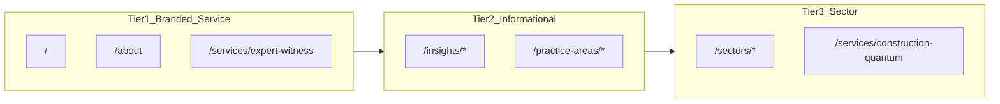

# SEO Architecture — sterlingforensic.co.uk

Canonical SEO strategy and technical reference for **Sterling Forensic**, a branded UK boutique forensic accounting practice.

| Property | Value |
|----------|-------|
| Domain | `sterlingforensic.co.uk` |
| Canonical host | `https://www.sterlingforensic.co.uk` |
| Locale | `en-GB` |
| Site type | Branded firm website (not a directory or lead-gen aggregator) |
| Deployment | Netlify (`netlify.toml`) |

**Code references:** [`lib/site-config.ts`](../lib/site-config.ts), [`app/layout.tsx`](../app/layout.tsx), [`lib/metadata.ts`](../lib/metadata.ts), [`lib/schema.ts`](../lib/schema.ts), [`lib/seo/publicUrlInventory.ts`](../lib/seo/publicUrlInventory.ts)

---

## Overview and positioning

Sterling Forensic is positioned as a premium boutique forensic accounting practice — between Big 4 firms (impersonal, expensive) and sole practitioners (limited scope). The `.co.uk` domain signals a dedicated UK practice; the "Sterling" brand signals British quality, precision, and established expertise.

**Target audiences:**

1. Commercial litigation solicitors and barristers
2. Family law solicitors (financial remedy proceedings)
3. Insurers and corporate clients requiring fraud investigation
4. Construction dispute practitioners (TCC, adjudication)

**Brand positioning vs competitors:**

- Broader commercial scope than Lawson Forensic — construction quantum, multi-sector expertise, regulatory proceedings, and insolvency
- Direct senior practitioner access on every engagement
- UK-wide service across England and Wales



---

## 1. Keyword strategy

Keywords are organised in three tiers. Each tier maps to specific routes in the Next.js App Router. On-page placement rules apply at content authoring time.

### Tier 1 — Branded

| Keyword | Primary route(s) | Notes |
|---------|------------------|-------|
| Sterling Forensic | `/`, `/about`, sitewide | `SITE_NAME` in schema, nav, footer |
| Sterling Forensic expert witness | `/services/expert-witness`, `/` | H1 + meta title on service page |
| sterlingforensic.co.uk | `/` | Domain in Organization schema; canonical host |

### Tier 1 — Service

| Keyword | Primary route(s) | Notes |
|---------|------------------|-------|
| forensic accountant expert witness UK | `/services/expert-witness`, `/` | Default title template on homepage |
| forensic accounting expert witness UK | `/services/expert-witness` | Synonym variant; use in body copy and FAQ |
| construction quantum forensic accountant UK | `/services/construction-quantum`, `/practice-areas/construction-quantum` | Dual landing: service + practice area |
| forensic accountant SJE UK | `/services/expert-witness`, `/insights/sje-commercial-disputes-guide` | SJE FAQ schema on expert-witness page |

### Tier 2 — Informational

| Keyword | Primary route(s) | Notes |
|---------|------------------|-------|
| forensic accountant construction dispute UK | `/practice-areas/construction-quantum`, `/insights/forensic-accountant-construction-quantum` | Insight targets long-tail informational intent |
| Emden formula construction forensic accountant | `/services/construction-quantum`, `/insights/forensic-accountant-construction-quantum` | FAQ schema on construction-quantum service |
| forensic accountant shareholder dispute UK | `/practice-areas/commercial-disputes`, `/insights/shareholder-dispute-fair-value-guide` | s994 Companies Act content |
| forensic accountant divorce valuation UK | `/practice-areas/family-proceedings` | **Gap:** no dedicated insight article yet — planned Q1 2026 |

### Tier 3 — Sector specific

| Keyword | Primary route(s) | Content file |
|---------|------------------|--------------|
| construction forensic accountant UK | `/sectors/construction-engineering` | [`lib/content/sectors.ts`](../lib/content/sectors.ts) |
| technology business forensic accountant UK | `/sectors/technology-digital-businesses` | [`lib/content/sectors.ts`](../lib/content/sectors.ts) |
| professional practice forensic accountant UK | `/sectors/professional-practices` | [`lib/content/sectors.ts`](../lib/content/sectors.ts) |
| retail hospitality forensic accountant UK | `/sectors/retail-hospitality` | [`lib/content/sectors.ts`](../lib/content/sectors.ts) |

### On-page placement rules

| Tier | Placement |
|------|-----------|
| Tier 1 | H1, `<title>`, first 100 words, Organization/ProfessionalService schema |
| Tier 2 | Insight article headlines, practice-area `metaDescription`, FAQ questions |
| Tier 3 | Sector page `metaTitle` and `metaDescription`; sector H1 |

### Internal linking hierarchy

```
/ (homepage)
├── /services/expert-witness          ← Tier 1 service hub
├── /services/construction-quantum    ← Tier 1 construction hub
├── /practice-areas/*                 ← Tier 2 practice depth
├── /sectors/*                        ← Tier 3 sector landing
└── /insights/*                       ← Tier 2 informational long-tail
```

---

## 2. Entity optimisation

Consistent NAP (Name, Address, Phone) across all citations strengthens entity recognition in Google Knowledge Graph and directory listings.

### Canonical entity data

| Field | Value |
|-------|-------|
| **Name** | Sterling Forensic |
| **Domain** | sterlingforensic.co.uk (www canonical) |
| **Email** | info@sterlingforensic.co.uk |
| **Country** | United Kingdom (England and Wales) |

### Citation targets

| Platform | Handle / listing | URL |
|----------|------------------|-----|
| LinkedIn | sterlingforensic | `https://www.linkedin.com/company/sterling-forensic` |
| Google Business Profile | Sterling Forensic | Create/claim in Google Business |
| jspubs.com | Sterling Forensic | Expert witness directory listing |
| Academy of Experts | Sterling Forensic | Professional body listing |
| EWI | Sterling Forensic | Expert Witness Institute listing |

All listings must use the exact brand name **"Sterling Forensic"** — no abbreviations, no "Sterling Forensic Ltd" unless that is the registered legal entity name used consistently everywhere.

### Schema alignment

The homepage emits a JSON-LD graph via [`lib/schema.ts`](../lib/schema.ts):

- `WebSite` — `inLanguage: "en-GB"`, `SearchAction` (see known gaps)
- `Organization` — name, email, `addressCountry: "GB"`, `sameAs: [LinkedIn]`
- `ProfessionalService` — `serviceType: "Forensic Accounting"`, `areaServed: GB`

**Recommended enrichments** (when address and phone are confirmed):

- Full `PostalAddress` with street, city, postcode
- `telephone` on Organization
- `logo` as `ImageObject`
- GBP profile URL in `sameAs` array
- Directory listing URLs (jspubs, Academy of Experts, EWI) in `sameAs`

---

## 3. .co.uk geotargeting advantage

Sterling Forensic's `.co.uk` ccTLD provides **implicit UK geotargeting**. Google treats ccTLDs as strong geographic signals. No `hreflang="en-GB"` alternate is required for a single-locale UK site.

### Existing UK signals in codebase

| Signal | Location |
|--------|----------|
| `lang="en-GB"` on `<html>` | [`app/layout.tsx`](../app/layout.tsx) |
| `openGraph.locale: "en_GB"` | [`lib/metadata.ts`](../lib/metadata.ts) |
| `inLanguage: "en-GB"` in WebSite schema | [`lib/schema.ts`](../lib/schema.ts) |
| `areaServed: GB` on Organization and services | [`lib/schema.ts`](../lib/schema.ts) |
| Apex → www 301 redirect | [`middleware.ts`](../middleware.ts) |
| UK-specific copy (CPR Part 35, FPR Part 25, TCC, adjudication) | Content files |

### hreflang: x-default

For completeness, add `x-default` in root layout metadata even though no alternate locales exist:

```typescript
// app/layout.tsx — recommended addition
export const metadata: Metadata = {
  // ...existing fields
  alternates: {
    canonical: SITE_URL,
    languages: { "x-default": SITE_URL },
  },
};
```

Per-page canonicals via `createMetadata()` in [`lib/metadata.ts`](../lib/metadata.ts) remain unchanged. Only the root layout needs the `x-default` declaration.

**Status:** Implemented via `rootLayoutMetadata()` in [`lib/metadata.ts`](../lib/metadata.ts), merged in [`app/layout.tsx`](../app/layout.tsx).

---

## 4. Differentiation from Lawson Forensic

Sterling Forensic and Lawson Forensic are sibling branded firm sites. Content must **not overlap** — each site serves different search intents within the branded forensic accountant category.

| Dimension | Lawson Forensic | Sterling Forensic |
|-----------|-----------------|-------------------|
| **Scope** | Depth in a narrower specialist niche | Breadth: construction, multi-sector, regulatory quantum, insolvency |
| **Content focus** | Specialist depth articles on core practice | Sector landing pages, construction quantum, cross-practice guides |
| **Keyword ownership** | Lawson-branded terms + Lawson niche clusters | Sterling-branded + construction/sector UK terms |
| **Construction** | Not a primary content pillar | Core differentiator — Emden, TCC, adjudication |
| **Sectors** | Limited or absent | Dedicated sector pages (construction, technology, professional practices, retail/hospitality) |

### Cannibalisation rules

1. **Never target Lawson brand terms** — "Lawson Forensic", "Lawson Forensic expert witness", etc.
2. **Do not duplicate Lawson topic clusters** — if Lawson owns a deep article on a narrow topic, Sterling covers the adjacent breadth angle instead
3. **Own Sterling-specific clusters:** construction quantum, Emden formula, sector forensic accountant UK, SJE breadth across practice areas
4. **Insights calendar topics must not mirror Lawson's quarterly schedule** — same cadence (4/year), different subject matter

---

## 5. Insights publishing calendar

Quarterly publishing cadence: **4 articles per year**, added to [`lib/content/insights.ts`](../lib/content/insights.ts). New slugs are auto-included in the sitemap via [`lib/seo/publicUrlInventory.ts`](../lib/seo/publicUrlInventory.ts).

### Published (baseline)

| Quarter | Article | Slug | Target keyword |
|---------|---------|------|----------------|
| Q3 2025 | Single Joint Expert Appointments in Commercial Disputes | `sje-commercial-disputes-guide` | forensic accountant SJE UK |
| Q3 2025 | Fraud Investigations Under Legal Professional Privilege | `fraud-investigation-lpp-guide` | fraud investigation LPP |
| Q4 2025 | Fair Value in Shareholder Disputes | `shareholder-dispute-fair-value-guide` | forensic accountant shareholder dispute UK |
| Q4 2025 | Forensic Accountant's Role in Construction Quantum | `forensic-accountant-construction-quantum` | Emden formula, construction dispute UK |

### Planned (Sterling-specific)

| Quarter | Topic | Target keyword tier | Suggested slug |
|---------|-------|---------------------|----------------|
| Q1 2026 | Forensic accountant divorce valuation UK | Tier 2 | `forensic-accountant-divorce-valuation-uk` |
| Q2 2026 | Construction adjudication: forensic accounting timelines | Tier 2 construction | `construction-adjudication-forensic-accountant` |
| Q3 2026 | Technology sector SaaS valuation in disputes | Tier 3 technology | `technology-saas-valuation-disputes` |
| Q4 2026 | Professional practice goodwill in family proceedings | Tier 3 professional practice | `professional-practice-goodwill-valuation` |

### Article authoring checklist

Each new insight article must include:

- [ ] `slug`, `title`, `metaTitle`, `metaDescription` targeting a Tier 2 or Tier 3 keyword
- [ ] `datePublished` and `dateModified` (ISO 8601)
- [ ] At least 3 sections with substantive UK legal context
- [ ] Internal links to relevant service, practice-area, or sector pages
- [ ] `Article` JSON-LD via `articleSchema()` in [`lib/schema.ts`](../lib/schema.ts)
- [ ] Entry added to [`lib/content/insights.ts`](../lib/content/insights.ts) — sitemap updates on next build

---

## 6. Technical SEO architecture

### Metadata pipeline

[`lib/metadata.ts`](../lib/metadata.ts) — `createMetadata()` factory used by all 19 page routes:

- Canonical URL per page (`alternates.canonical`)
- OpenGraph (`locale: "en_GB"`, `type: "website"`)
- Twitter card (`summary_large_image`)
- Robots directives (`index`/`follow`, overridable via `noindex`/`nofollow`)

Root layout defaults in [`app/layout.tsx`](../app/layout.tsx):

- `metadataBase` → `SITE_URL`
- Title template: `%s | Sterling Forensic`
- Google Search Console and Bing verification via env vars

### Sitemap and robots

| File | Generator | Notes |
|------|-----------|-------|
| `public/sitemap.xml` | [`scripts/generate-seo.ts`](../scripts/generate-seo.ts) | Runs on `prebuild`; ~35 URLs |
| `public/robots.txt` | [`scripts/generate-seo.ts`](../scripts/generate-seo.ts) | Disallows `/thank-you`, `/api/` |

URL inventory source of truth: [`lib/seo/publicUrlInventory.ts`](../lib/seo/publicUrlInventory.ts)

- Static routes: `/`, `/about`, `/services`, `/practice-areas`, `/sectors`, `/case-studies`, `/qualifications-accreditations`, `/how-we-work`, `/insights`, `/contact`, `/faq`
- Dynamic routes: services (6), practice areas (7), sectors (5), case studies (4), insights (4)
- Excluded from sitemap: `/privacy`, `/terms`, `/thank-you`, `/fees`

CI verification: [`.github/workflows/seo-checks.yml`](../.github/workflows/seo-checks.yml) runs `npm run seo:verify` on PRs.

### Structured data

[`lib/schema.ts`](../lib/schema.ts) + [`components/ui/JsonLd.tsx`](../components/ui/JsonLd.tsx):

| Schema type | Pages |
|-------------|-------|
| `WebSite` + `Organization` + `ProfessionalService` | `/` |
| `Organization` | `/about` |
| `Service` graph (6 services) | `/services` |
| `Service` (per page) | `/services/[slug]` |
| `BreadcrumbList` | Most inner pages |
| `FAQPage` | `/faq`, service/sector/practice-area slugs with FAQs |
| `Article` | `/insights/[slug]`, `/case-studies/[slug]` |

### Redirects

[`next.config.ts`](../next.config.ts) — legacy 301s:

- `/expert-witness` → `/services/expert-witness`
- `/investigations` → `/services/fraud-investigation`
- `/fees` → `/contact`

[`middleware.ts`](../middleware.ts) — `sterlingforensic.co.uk` → `www.sterlingforensic.co.uk`

### Known gaps

| Gap | Impact | Priority | Status |
|-----|--------|----------|--------|
| No OG/Twitter images | Poor social preview cards | Medium | **Done** — `app/opengraph-image.tsx` + default images in `createMetadata()` |
| No favicon or web manifest | Browser tab / PWA | Low | **Partial** — `app/icon.tsx`; web manifest still optional |
| `x-default` hreflang not in layout | Minor completeness gap | Low | **Done** — `rootLayoutMetadata()` |
| FAQ and contact excluded from sitemap | Reduced crawl discovery | Medium | **Done** — included in `publicUrlInventory.ts` |
| `SearchAction` schema without site search UI | Potential rich-result mismatch | Low | **Done** — removed from WebSite schema |
| `NEXT_PUBLIC_SITE_URL` unused | Wrong canonicals on preview deploys | Medium | **Done** — `lib/site-config.ts` reads env var |
| About page lacks JSON-LD | Missed Organization reinforcement | Low | **Done** — `organizationSchema()` on `/about` |
| Case studies lack Article/CaseStudy schema | Missed rich results | Low | **Done** — `caseStudySchema()` on case study pages |
| No dedicated divorce valuation insight | Tier 2 keyword gap | High (Q1 2026) | Planned |

---

## 7. Deployment checklist

Pre-launch and ongoing SEO verification.

### Infrastructure

- [ ] Netlify project connected to repository
- [ ] DNS `sterlingforensic.co.uk` pointed to Netlify
- [ ] Apex → www redirect verified ([`middleware.ts`](../middleware.ts))
- [ ] SSL certificate active on `www.sterlingforensic.co.uk`
- [ ] `npm run build` succeeds; `public/sitemap.xml` generated

### Entity and citations

- [ ] Google Business Profile created: **Sterling Forensic**
- [ ] LinkedIn company page live: **sterlingforensic**
- [ ] jspubs.com listing with consistent NAP
- [ ] Academy of Experts listing with consistent NAP
- [ ] EWI listing with consistent NAP

### On-site technical

- [ ] `html lang="en-GB"` confirmed in [`app/layout.tsx`](../app/layout.tsx)
- [x] `x-default` hreflang added to root layout metadata
- [ ] Google Search Console property verified (`GOOGLE_SITE_VERIFICATION`)
- [ ] Bing Webmaster Tools verified (`BING_SITE_VERIFICATION`)
- [ ] Sitemap submitted: `https://www.sterlingforensic.co.uk/sitemap.xml`

### Environment variables

All vars from [`.env.example`](../.env.example) must be set in Netlify:

| Variable | Purpose |
|----------|---------|
| `NEXT_PUBLIC_SITE_URL` | Canonical URL (read by `lib/site-config.ts`) |
| `GOOGLE_SITE_VERIFICATION` | Search Console meta tag |
| `BING_SITE_VERIFICATION` | Bing Webmaster meta tag |
| `NEXT_PUBLIC_GA_MEASUREMENT_ID` | Google Analytics 4 |
| `NEXT_PUBLIC_GTM_ID` | Google Tag Manager |
| `NEXT_PUBLIC_LINKEDIN_PARTNER_ID` | LinkedIn Insight Tag |
| `NEXT_PUBLIC_META_PIXEL_ID` | Meta Pixel (optional) |
| `NEXT_PUBLIC_HOTJAR_ID` | Hotjar (optional) |
| `GOOGLE_SERVICE_ACCOUNT_EMAIL` | Lead capture → Google Sheets |
| `GOOGLE_PRIVATE_KEY` | Lead capture → Google Sheets |
| `GOOGLE_SHEET_ID` | Lead capture → Google Sheets |
| `Lead_notification_url` | Lead notification webhook |

### Post-launch

- [ ] `npm run seo:verify` passes in CI
- [ ] Request indexing for homepage and top 5 service pages in Search Console
- [ ] Monitor branded search ("Sterling Forensic") within 2 weeks
- [ ] Review Core Web Vitals in Search Console after 28 days
- [ ] Publish Q1 2026 insight article per calendar above

---

## Appendix: full route inventory

### Static pages (in sitemap)

| Path | Tier relevance |
|------|----------------|
| `/` | Tier 1 branded + service |
| `/about` | Tier 1 branded |
| `/services` | Tier 1 service hub |
| `/practice-areas` | Tier 2 hub |
| `/sectors` | Tier 3 hub |
| `/case-studies` | Trust / E-E-A-T |
| `/qualifications-accreditations` | Trust / E-E-A-T |
| `/how-we-work` | Conversion support |
| `/insights` | Tier 2 hub |

### Dynamic pages (in sitemap)

| Pattern | Count | Tier |
|---------|-------|------|
| `/services/[slug]` | 6 | Tier 1 |
| `/practice-areas/[slug]` | 7 | Tier 2 |
| `/sectors/[slug]` | 5 | Tier 3 |
| `/case-studies/[slug]` | 4 | Trust |
| `/insights/[slug]` | 4 | Tier 2 |

### Utility pages (not in sitemap)

| Path | Indexable | Notes |
|------|-----------|-------|
| `/contact` | Yes | In sitemap |
| `/faq` | Yes | FAQ schema; in sitemap |
| `/privacy` | No (`noindex`) | Legal |
| `/terms` | No (`noindex`) | Legal |
| `/thank-you` | No (`noindex` + robots disallow) | Post-form |
